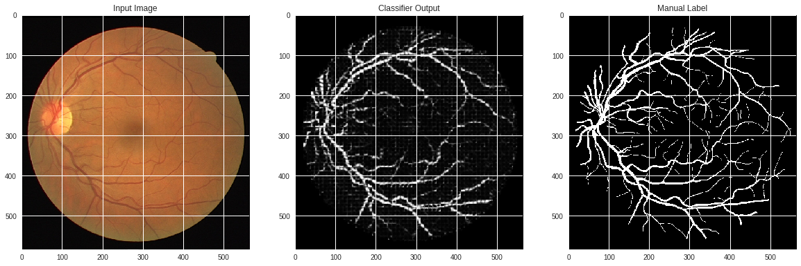

# Retinal Vessel Segmentation
Retinal vessel segmentation is a key step towards the accurate visualization, diagnosis, early treatment and surgery planning of ocular diseases. For the last two decades, a tremendous amount of research has been dedicated in developing automated methods for segmentation of blood vessels from retinal fundus images.   

Performance uptil now is as shown:  

